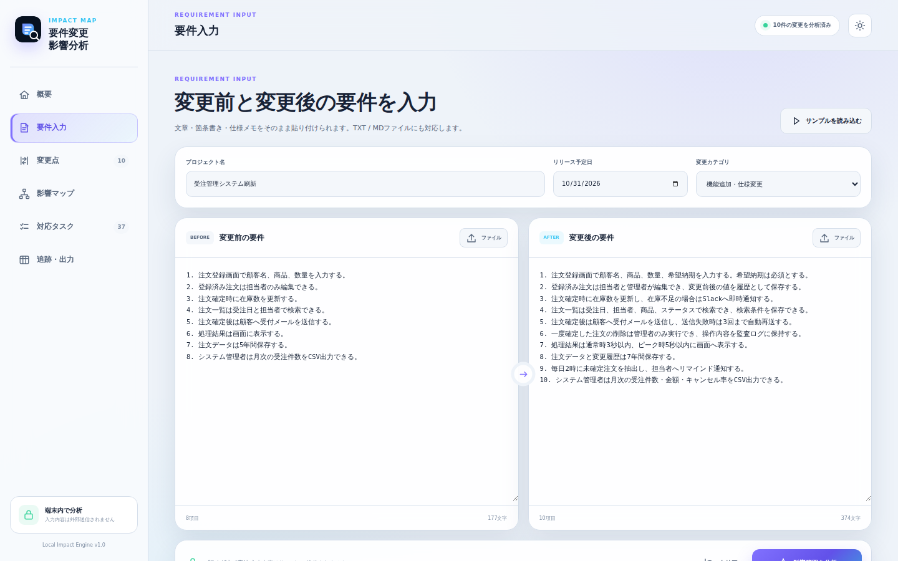
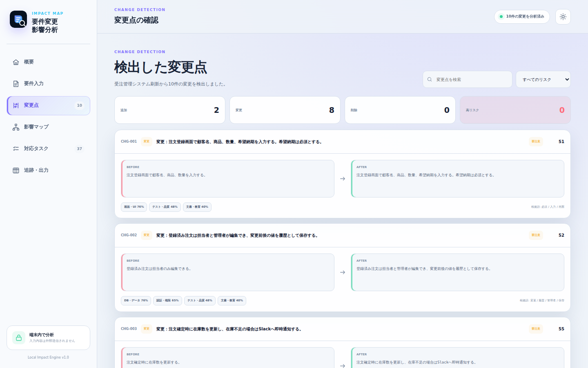
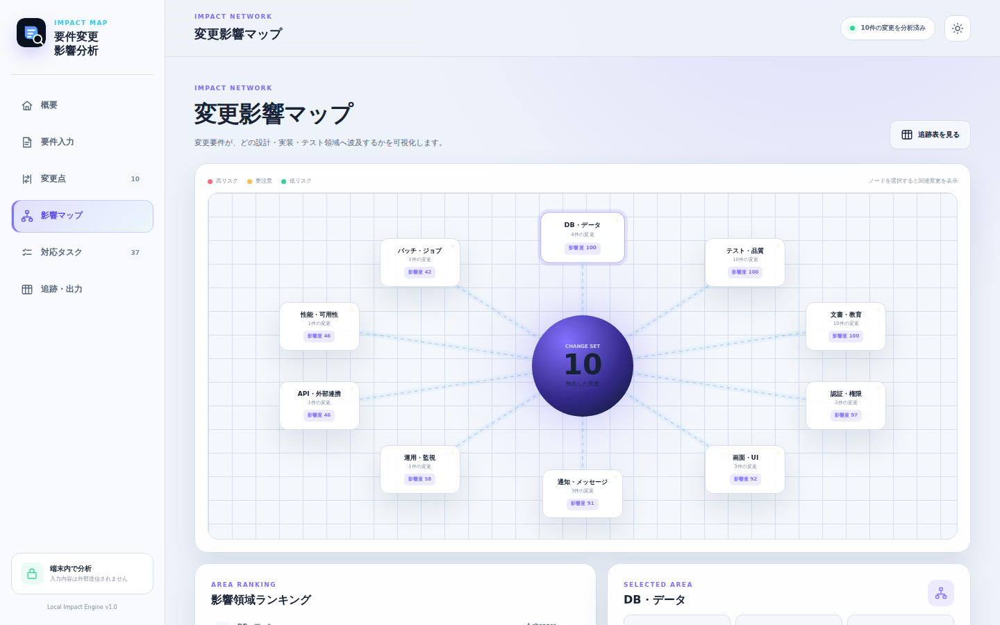
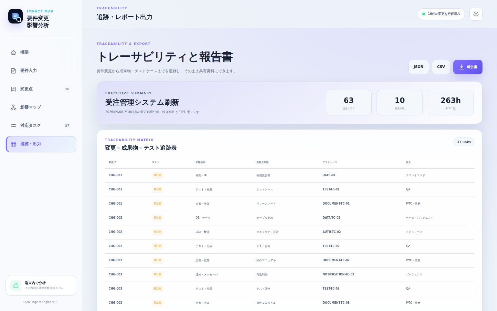

# 要件変更影響分析

要件の変更前・変更後を比較し、**画面・API・DB・認証・通知・バッチ・性能・運用・テスト・文書**への波及を可視化する、ブラウザ完結型のWebアプリです。

> 「要件が1行変わったとき、どこまで直す必要があるのか」を、変更一覧・リスク・対応タスク・トレーサビリティまで一気に整理します。

## デモ

- Vercel: https://requirements-impact-analyzer-shunsoco-stacks-projects.vercel.app/
- サンプル要件を初期表示しているため、アクセス直後から全画面を確認できます。

## スクリーンショット

### 1. 影響分析ダッシュボード


### 2. 変更前・変更後の要件入力



### 3. 変更点の比較



### 4. 変更影響マップ



### 5. トレーサビリティと報告書



## 主な機能

- 変更前・変更後の要件を文章または箇条書きで比較
- TXT / Markdown / CSVファイルの読み込み
- 追加・変更・削除の自動検出
- 変更単位のリスクスコアリング
- 10領域への影響分類
- 影響領域を俯瞰するネットワークマップ
- 担当チーム・成果物・テスト観点・概算工数を含むタスク生成
- 要件変更から成果物・テストケースまでのトレーサビリティ表
- Markdown / CSV / JSON出力
- タスク完了状態と入力内容の端末内保存
- ライト / ダークテーマ、レスポンシブ表示、PWA対応

## 想定ユーザー

- システムエンジニア、PM、PMO
- 要件定義・基本設計のレビュー担当者
- 保守開発で影響調査を行うチーム
- 顧客要望を実装タスクへ落とし込みたい受託開発会社

## 分析ロジック

本アプリは外部AI APIを利用せず、ブラウザ内で次の処理を実行します。

1. 要件を行・文単位へ正規化
2. 日本語N-gramと英数字トークンによる類似度計算
3. 変更・追加・削除の判定
4. キーワードと文脈類似度による影響領域分類
5. 変更種別・高リスク語・影響領域数によるリスク算定
6. 影響領域別の成果物・テスト・タスク生成

分析結果は設計レビューの**たたき台**です。法令、契約、セキュリティ、重要な本番変更では、必ず担当者による確認を行ってください。

## プライバシー

要件本文や分析結果はサーバーへ送信しません。入力・解析・レポート生成はすべてブラウザ内で完結し、保存する場合も `localStorage` のみを使用します。

## 技術構成

- HTML / CSS / Vanilla JavaScript
- ES Modules
- Node.js標準テストランナー
- Service Worker / Web App Manifest
- Vercel Static Hosting
- 外部ライブラリ・外部API・環境変数なし

## ローカル実行

```bash
git clone <repository-url>
cd requirements-impact-analyzer
npm start
```

ブラウザで `http://localhost:4173` を開きます。

## テストとビルド

```bash
npm test
npm run build
npm run check
```

`npm run check` は次をまとめて実行します。

- JavaScript構文チェック
- 分析エンジンの自動テスト
- Vercel向け単一HTMLビルド

現在の自動テストは **6件すべて成功**しています。

## ディレクトリ構成

```text
.
├── app.js                     # 画面描画・操作・出力
├── index.html                 # アプリUI
├── styles.css                 # レスポンシブデザイン
├── lib/
│   └── analyzer.js            # 差分・影響・リスク分析エンジン
├── tests/
│   └── analyzer.test.js       # 自動テスト
├── scripts/
│   └── build.mjs              # 静的デプロイ用ビルド
├── docs/screenshots/          # README用スクリーンショット
├── manifest.webmanifest       # PWA設定
├── sw.js                      # オフラインキャッシュ
└── vercel.json                # セキュリティヘッダー等
```

## 今後の拡張候補

- Excel / Word / PDFからの要件抽出
- GitHub Issues / Linear / Jiraへのタスク連携
- 独自キーワード辞書と重みの編集
- 複数案件の履歴管理
- 生成AIを任意で接続する詳細レビュー機能
- チーム内コメント・承認フロー

## License

MIT License
